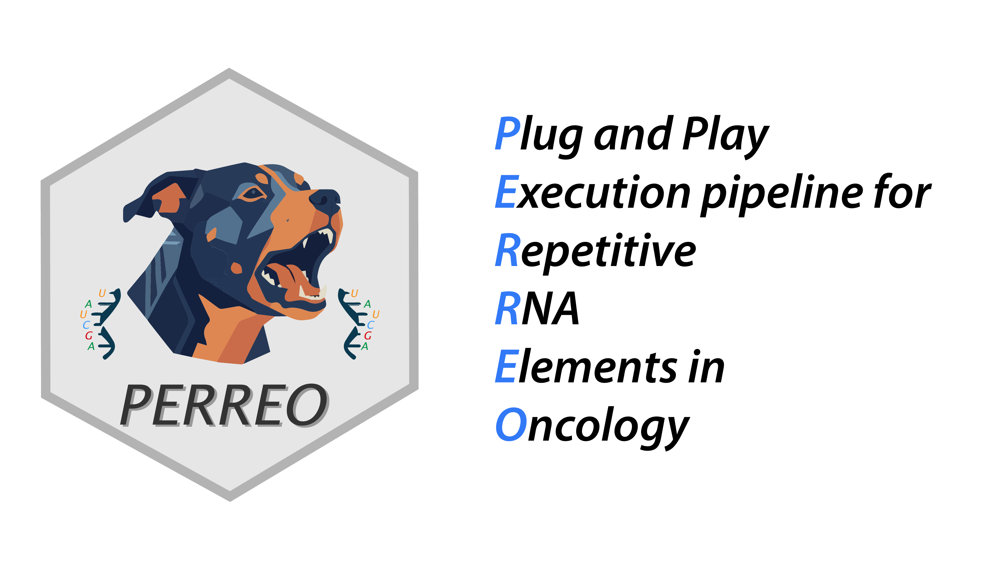

# PERREO

PERREO is a repeat RNA analysis pipeline for RNA-seq datasets. It supports three sequencing modes:

- **PERREO SR-SE** for single-end short-read RNA-seq.
- **PERREO SR-PE** for paired-end short-read RNA-seq.
- **PERREO LR** for Nanopore direct RNA-seq long reads.

The pipeline covers trimming and alignment, repeat RNA quantification, differential expression analysis, coexpression analysis, transcriptome assembly, hybrid transcript discovery, prediction model design, and PDF report generation.

## Workflow

The workflow starts from FASTQ files, a reference genome, and repeat annotations. Short-read modes use STAR for alignment, while long-read mode uses minimap2. Downstream analysis is shared across modes with mode-specific quantification settings.

## Documentation Map

- Start with [Installation](installation.md) to create the conda environment.
- Read [Data Preparation](data-preparation.md) to organize inputs and samplesheets.
- Use [Running PERREO](running.md) for the graphical interface and command-line entry points.
- Choose the correct mode under [Modes](modes.md).
- Review [Downstream Analysis](downstream-analysis.md) and [Outputs](outputs.md) to understand generated results.
